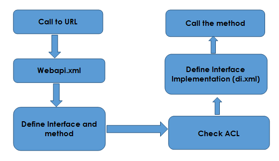
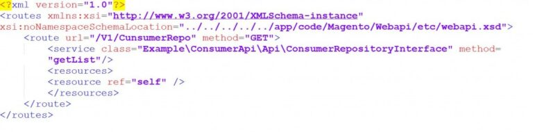
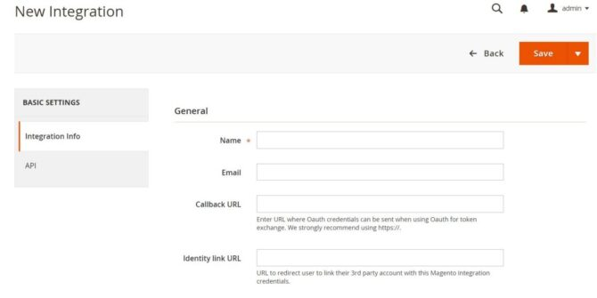
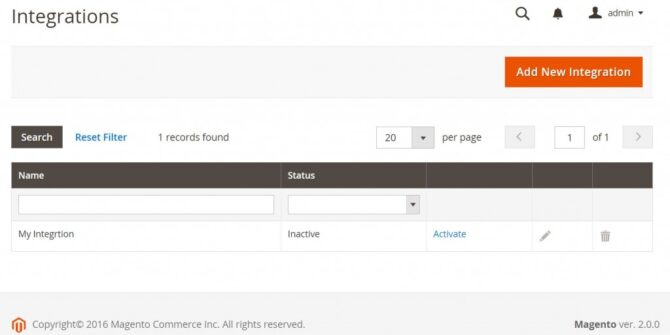
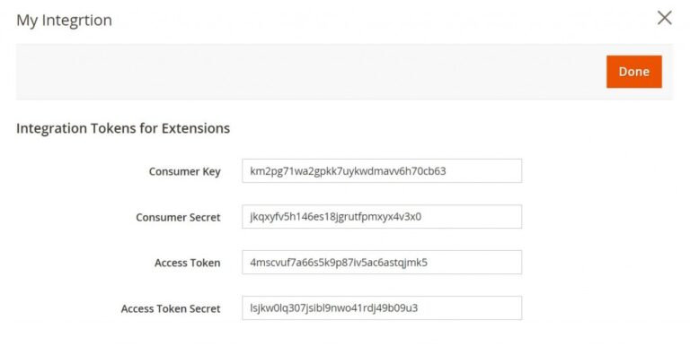
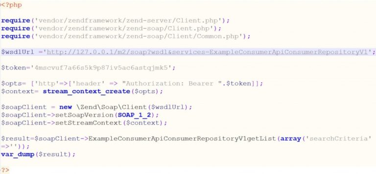

# Implementing SOAP & REST API in Magento 2

*Unlock numerous possibilities with integrations for your eCommerce store with Magento integration. Let’s get started*

Magento web API framework is used to communicate third party services with the Magento System. In Magento 2, the web API allows exposure of the module API (service contact) through the WEB API. It extends the  functionality from Magento 1 API.

Each repository and API are available through web API. It follows strict definition for all the classes, parameters and return values.

We have to declare a URL in webapi.xml and need to specify the required interfaces (available services) and methods for the APIs.

## Implementing SOAP & REST API in Magento 2

We have two types of protocols to make a repository available through web API

- [SOAP API](http://devdocs.magento.com/guides/v2.0/soap/bk-soap.html) (Simple Object Access Protocol)
- [REST API](http://devdocs.magento.com/guides/v2.0/rest/rest_endpoints.html) (Representational State Transfer) 

It is easier to implement REST API because it is less strict than SOAP API. The implementation is taken from the di.xml file, which calls the method.

The diagram below shows the process in detail.

## Example webapi.xml

*Router* contains the URL and a method (GET, POST, and DELETE).

*Service* defines the interface class and the method for handling.

*Resources* defines the list of users (ACL Resource) for accessing the web API.

Three types of resources are available in Magento 2 for the web API

1. *Self* – available for customer data
2. *Anonymous* – available for all
3. *Magento ACL*  – Admin user (this requires permissions)

## Web API Authentication

There are three types of Authentication

1. OAuth
2. Token Based
3. Session Based 

For Token based authentication, we need to create an Admin user with specific permission.

## Integration of Web API

To create an integration, click System > Integration > Add New Integration. Be sure to restrict the resources that the integration can access.

Below are the screen shots of the procedure for new Integration and Activation.

## SOAP WSDL URL

WSDL is generated automatically for both system and custom services.

### WSDL Structure

``http://You Magento Host / soap?wsdl&services=  [Defined List of services]``

Example:

## REST Authentication

### This supports token based authentication.
URL for accessing through REST

``http://{Your Magento Repo}/rest/V1/ConsumerRepo?{Arguments}``

### Example:

``curl  -X GET "http://127.0.0.1/m2/rest/V1/ConsumerRepo" –H  "Authentication : Bearer_Token-"``

One of the many goals of Magento 2 is  to improve on the web APIs. For more information on Magento 2 web API , please go through the documentation below

http://devdocs.magento.com/guides/v2.0/get-started/bk-get-started-api.html